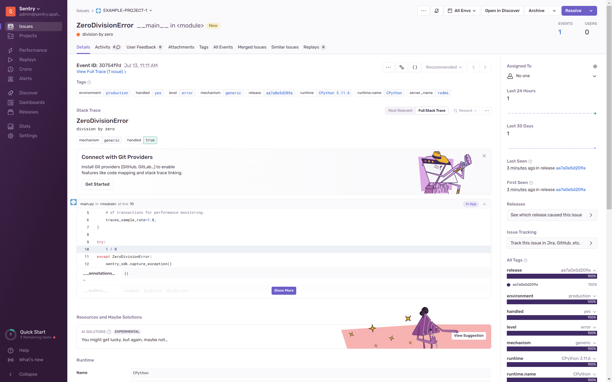

В современном мире разработки программного обеспечения отслеживание и анализ ошибок является критически важным компонентом для обеспечения стабильности и качества приложений. 
В этой статье мы рассмотрим Sentry — мощный инструмент, предназначенный для мониторинга и управления ошибками в реальном времени. 
Sentry позволяет разработчикам и командам быстро обнаруживать, классифицировать и устранять проблемы, 
тем самым сокращая время выхода новых релизов и повышая удовлетворенность пользователей. 
Давайте углубимся в возможности Sentry и то, как он может стать вашим надежным помощником в обеспечении надежности ваших приложений.

Sentry обладает рядом преимуществ, которые делают его популярным выбором среди разработчиков и команд, занимающихся мониторингом exception.

 - Открытый исходный код (Open Source): Sentry имеет открытый исходный код по адресу https://github.com/getsentry/sentry, что позволяет разработчикам использовать его бесплатно, модифицировать и расширять по своему усмотрению. Это также означает, что сообщество активно участвует в его развитии и поддержке.

 - Широкая поддержка языков и фреймворков:  Sentry поддерживает множество языков программирования и фреймворков, включая .NET, C++, Elixir, Flutter, Go, Java, JavaScript, Kotlin, Objective-C, Perl, PHP, Python, React Native, Ruby, Rust, Swift. Это делает его универсальным инструментом для различных типов проектов.

 - Детальная информация об ошибках: Sentry предоставляет подробную информацию об ошибках, включая стек вызовов, переменные окружения, пользовательские данные и контекст выполнения. Это помогает быстро идентифицировать и исправлять проблемы.

 - Аналитика и отчеты: Sentry предоставляет мощные инструменты для анализа ошибок и создания отчетов. Вы можете видеть статистику по ошибкам, тренды их возникновения, а также детальный анализ отдельных событий.

 - Самостоятельное развертывание (Self-Hosted): Sentry можно развернуть на собственных серверах, что обеспечивает полный контроль над данными и конфиденциальностью. Это особенно важно для проектов, которые работают с чувствительной информацией.

 - Обширная документация и поддержка сообщества: Sentry имеет обширную документацию, которая помогает разработчикам быстро начать работу и решать возникающие проблемы. Кроме того, активное сообщество пользователей и разработчиков обеспечивает поддержку и обмен опытом.

Эти преимущества делают Sentry мощным и гибким инструментом для мониторинга ошибок и производительности приложений, подходящим для широкого круга проектов и команд.

# Регистриуем домен на reg.ru
# Исправляем домен apatsev.org.ru на ваш домен везде в коде
# Версии приложений меняем осторожно, иначе могут быть баги, например https://github.com/ClickHouse/ClickHouse/issues/53749

# Kubernetes
```shell
cd kubernetes
terraform init
terraform apply
cd ..
```

# PostgreSQL
```shell
cd postgresql
terraform init
terraform apply
terraform output fqdn_database
terraform output owners_data
cd ..
```

# Redis
```shell
cd redis
terraform init
terraform apply
terraform output fqdn_redis
terraform output password
cd ..
```

# S3
```shell
cd s3
terraform init
terraform apply
terraform output access_key
terraform output secret_key
cd ..
```

# Устанавливаем новое подключение к k8s

# namespace sentry
```shell
kubectl create namespace sentry
```

# Установка zookeeper, altinity-clickhouse-operator, strimzi-kafka-operator
```shell
helmwave up --build
```
Ждем когда pod перейдут в состояние Running

# kafka
# Из примеров https://github.com/strimzi/strimzi-kafka-operator/tree/main/examples/kafka берем Kafka и KafkaTopic
```
kubectl apply -f kafka-node-pool.yaml
kubectl apply -f kafka.yaml
kubectl apply -f kafka-topics.yaml
```

# Clickhouse
Придумываем пароль и получаем от него sha256 хеш
```
printf 'sentry-clickhouse-password' | sha256sum
```
Полученный хеш вставляем в поле "sentry/password_sha256_hex"

Из примеров https://github.com/Altinity/clickhouse-operator/tree/master/docs/chi-examples сделать конфиг для clickhouse
Затем применить его
```shell
kubectl apply -f kind-ClickHouseInstallation.yaml
```
Ждем когда появятся 3 пода chi-sentry-clickhouse-sharded-x-0-0
Ждем когда все pod перейдут в состояние Running
Ждем когда все поды Clickhouse найдут друг друга и Clickhouse перестанет писать в логи ошибки ServerErrorHandler или Cannot resolve host
Чтобы увидеть логи Clickhouse, можно использовать stern для просмотра логов в namespace sentry
```
stern -n sentry -l clickhouse.altinity.com/chi=sentry-clickhouse
```

# Установка sentry
```shell
helm repo add sentry https://sentry-kubernetes.github.io/charts
helm repo update
helm install sentry -n sentry sentry/sentry --version 23.1.0 -f values-sentry.yaml
```

Ждем Clickhouse миграции в pod snuba-migrate
Ждем завершения PostgreSQL миграции в pod db-init-job
Чтобы увидеть лог миграции snuba-migrate, можно использовать stern для просмотра логов в namespace sentry
```
stern -n sentry -l job-name=sentry-snuba-migrate
```

Чтобы увидеть лог миграции db-init, можно использовать stern для просмотра логов в namespace sentry
```
stern -n sentry -l job-name=sentry-db-init
```
Открываем URL, прописанный в system.url
Входим в sentry по кредам, которые вы указали в этом коде
```
user:
  password: "пароль"
  create: true
  email: логин-в-виде-email
```

Создаем project, выбираем python.
Создаем директорию example-python.
Переходим в директорию example-python
В директории example-python создаем main.py такого содержания
```shell
import sentry_sdk
sentry_sdk.init(
    dsn="http://xxxx@sentry.apatsev.org.ru/2",
    traces_sample_rate=1.0,
)

try:
    1 / 0
except ZeroDivisionError:
    sentry_sdk.capture_exception()
```

```shell
python3 -m venv venv
source venv/bin/activate
pip install --upgrade sentry-sdk
```
В Sentry видим следующую картину
